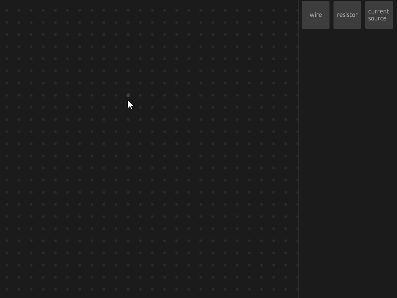

# Circuit
An application that simulates an electrical circuit using Kirchhoff's laws

Demo:

# App overview
The App supports wires, resistors and current sources.

The current direction and current & voltage value are shown using moving charges.

There's ability to edit current source and resistor parameters: double click on it and the panel will appear on the left.

# Controls

Click to an element in the right panel and set two points on the workspace to add new element.

Panning across the workspace: drag with the left mouse button.

Zoom: hold Ctrl and scroll the mouse wheel.

Selection:
- Click an element to select it.
- Hold Shift and click to add an element to the current selection.
- Drag with the right mouse button to select elements using a selection area. An element is selected only if it is fully contained within the selection area.

Remove selected elements using `delete` key.
